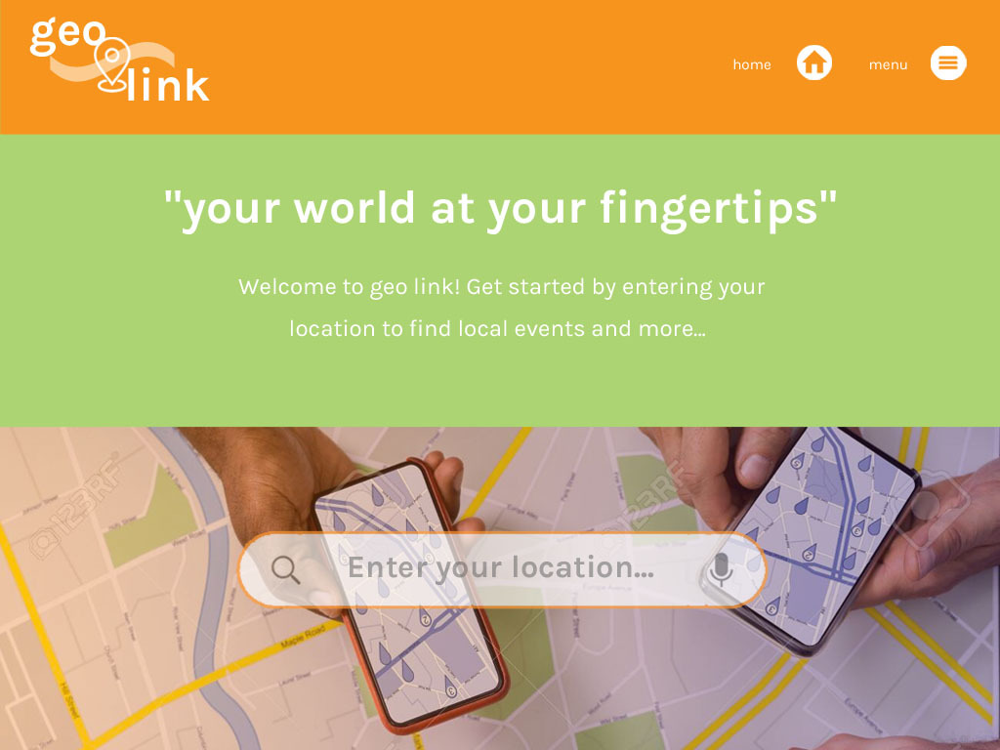
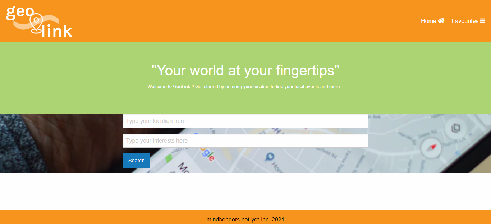
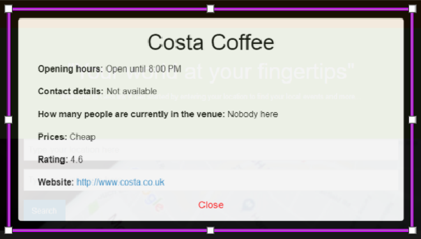
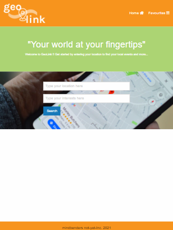
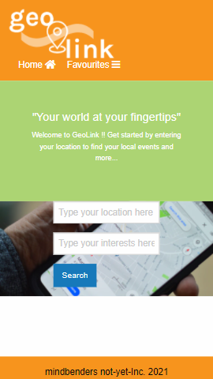
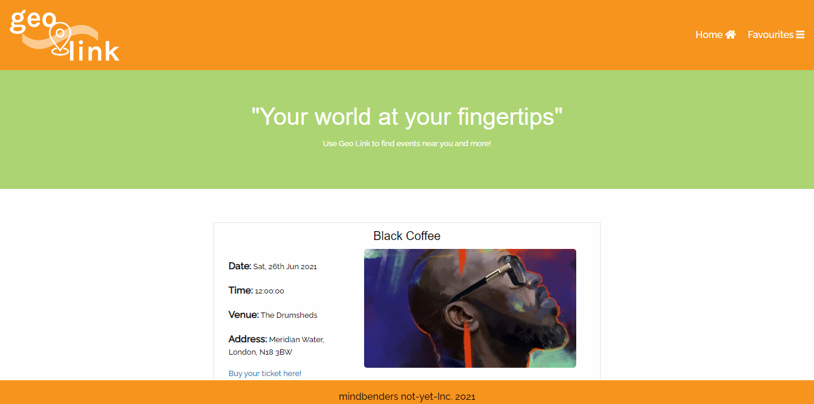

# Geo Link

Geo Link is a website to connect people around the world. This makes it easier to make friends and meet up people.

- This website is easy to use and quickly accessible.
- Connects you to various people through your interests and activities.

Hope you enjoy it !!

## Link to Github profile

https://github.com/ivnkris/geo-link

## Contributors

- Kris Ivan
- Syreeta
- Nazia
- Farah
- Eti Priya

https://github.com/ivnkris/geo-link

## Description of the website

This website searches the interests and near by places to meet up and make new friends. It includes

- A home page which has interests search button and location button.
- One needs to enter both and click on search. It will show you the information through various cards.
- You could select the location and to whom so ever you would like to meet according to your choice.
- Anyone could add the location to their favourites and have a look at them at a later stage.
- It also gives you information regarding the selected location as name of the location, address of the location and map also.
- In this website, it is easy to create a bundle of cards in your favourites by just clicking on "Add to my favourites" button.
- If you click on "More Information" card, it will give you more information for the clicked location.
- In this website, you could easily remove a card from your favourites.
- This website is easy to use and keep a record of the places where you would like to go again.

## Screenshots

Before Refractor

After refractor

- Homepage

- Favourites Page

- More information page

- Tablet Screen shot

- Mobile screen shot

- Event information

## Link to the deployed application

https://ivnkris.github.io/geo-link/

## Project Overview

In the midst of lockdown, our project Geo-link aims to connect and bring people of different backgrounds together based on their location and common interest. Hence, bringing normality back to our daily lives.

## Objectives

- Real-time event monitoring
- Allow user to save their favourite events for future
- Enhance user experience on the events happening at that venue.

## Getting started

We started the project with the following steps:

- We created a mockup image about the requirements.
- We started with HTML and CSS coding by using foundation CSS.
- Then we moved into JS coding and attaching the API's with the code.
- We checked the result at every moment with console.log.
- We verified the result and then completed the task.

## Project Charter

Geo link is a project which is build on an idea of connecting people in such tough times. The high-level planning included a documentation of the requirements and creating a mock-up of the website page and extended pages.

**Key requirement** - tasks, roles and responsibilities were allotted at the starting of the project. We used:

- Wire frames - Mock flow
- Mock ups - Adobe CS
- Frontend - HTML, CSS, JavaScript, Zurb Foundation, Fontawesome
- Backend - Jquery, Foursquare API, Google places API, local storage

## User Journeys

- **Make a search** - User could use this webite easily on his mobile, tablet or computer and find a location according to his interest.
- **Meeting up single or multiple people** - user could click on the event and move to that event and enjoy by meeting up many people at once.

- **View more information about a single venue.** - Any user could click on "more information" button and view the details about that place like date, time, venue and event.

- **Add/remove your favorite venues** - User could easily remove an event or venue from favourite page by just clicking on "Remove Button".

- **View events within 50 miles of a venue** - This website helps to look at the events happening within 50 miles of range.

## Project Retrospective

**Work done**

- Geo link is a wonderful platform which helps people communicate and meetup easily.
- Geo link is a handy guide wrapped up in an interactive app which brings back multiple results with proper location, map and venue, for a single search.
- It depends on the interests and various activities which everyone used to do.

**Learning**

- It helped us understand the usage of various API's, foundation for CSS design, local storage.
- It also helped us understand the JS coding by using JQuery.

**Improvements to be made**

- This project could be improved by adding more details about the events that will be happening in near future.
- Also, we could add a reminder for every individual for the events which they have added to favourite.

**Lessons learnt** : We learned about various things:

- **Related to API** - We looked into influence of an API on the project as using Google maps API was a bit difficult.

- **Foursquare API** - It will be deprecated in a week and it lacked certain elements and it was difficult to use.

- **Ticket Master API** - This will also be deprecated and it was new to use.

- **Google Maps** - We got a problem to use google maps as GitHub pages doesn't recognize google map.

- **Sass application** - This was not recognised well, we need to implement it in other applications.

# Timeline

Every task was given a limited time and whole team has been into the project. So, everyone completed the task and helped each other in a great manner.

For each task,

- Mock up Design – 30-40 minutes
- HTML/CSS - 45 minutes to 1 hour
- JS/JQuery - 5 days
- API implementation – 30min
- Project documentation - 1day
- Full project - 90 hours

# Results

Objectives were achieved as below:

- Our website instantly grabs user location data on load.

- It adds the cards to favorite page on one click.

- It removes a favorite card easily from favorite page.

- It gives more information about the place on click of "more information".

- It gives full details related to a location which includes date, time, venue and address.

- It shows the number of events happening at that time.

- It shows the more information,view events and remove the card from favorite on favorite page.

- It easily comes back to the home page.
